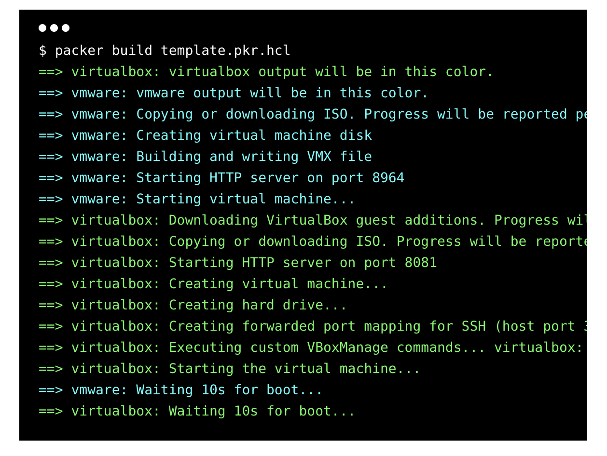

# Packer

Packer é uma ferramenta para automatizar o processo de criação de máquinas virtuais tanto localmente quanto na nuvem. 

Packer é compatível com os pricinpais provedores de nuvem e virtualizadores como  Amazon EC2, CloudStack, DigitalOcean, Docker, Google Compute Engine, Microsoft Azure, QEMU, VirtualBox, VMware, e mais.

## O que voce vai encontrar neste repositório?

Este repositório contém exemplos práticos sobre como utilizar o `Packer` para criação de maquinas virtuais em seu ambiente local usando o `VirtualBox` e em nuvem `AWS` e `GCP`.

## Integrações 

Packer pode ser integrado com vários `configurations management` como ansible, puppet, chef, e etc. A fim de automatizar o processo de instalação, configuração de pacotes, tarefas e mais.

## Ansible

Ansible é do mais utilizados `configuration management` atualmente. Possui uma instalação e configuração bem simples e prática, não necessita de nenhum `agent` para se comunicar remotamente.

___

  

